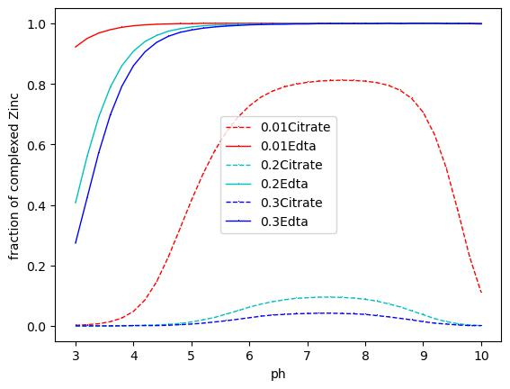

# Summary
This toolkit is designed to enable researchers to effectively explore metal-ligand relationships in soil and model this behavior using PHREEQC. PHREEQC is a widely used open source program developed by Parkhurst and Apello (2013) for modelling and simulating chemical reactions in aqueous systems. PHREEQC contains 13 databases which store thermodynamic data of numerous reactions. Selecting the most suitable database for modelling is user dependent and requires careful consideration of the specific geochemical problem being studied. For instance, [@Northover:2022] highlighted significant variations within conditional logβ values determined in their work and literature values for the formation of [Zn(Cit)]− in different 1:1 electrolyte differing over two orders of magnitudes. The toolkit proposed in this work addresses this challenge by implementing a search module which scopes all PHREEQC databases for the relevant reaction. 
A toolkit has been developed to enhance PHREEQC utility by providing additional functionality focusing on data extraction from PHREEQC databases and manipulation of this data. Manipulation involves calculating ion activities, generating PHREEQC input files for processing, and visually representing the results. It is important to note that the toolkit (except the search.py module) is designed to support data manipulation for Minteq.v4 / Minteq database or any database with the same format. The toolkit is written in python, offering a more streamlined and convenient experience for contributors and users. The toolkit is split across 14 python files which perform selected tasks such as data extraction from any PHREEQC database. The toolkit components can be utilized as stand-alone modules or in combination, allowing users flexibility in their application of the toolkit’s functionality. 
The utility of the toolkit can be demonstrated through a case study which involves the investigation of thermodynamic parameters for metal-ligand complexation. For example, to determine the pH and ion strength dependent stability for Zn(II) complexes with weak and strong ligands, and establish the location of the ligand exchange points (LEP),  [@Northover:2022], accurately determined intrinsic association constants and LEP manually. These analysis and calculations are usually elaborate and time consuming. In this context, using the toolkit, the same results can be achieved automatically, streamlining the process.  

# Statement of need
Geochemical modelling programs offer a way to study complex environmental or aqueous systems, however, the use of such software is not fully optimised due to several factors. One of these factors is the variation in thermodynamic parameters for selected reactions and phase properties, such as enthalpy and stability constant (logK), across different databases. Table 1 shows how different databases may provide different logK values for the same parameters, leading to inconsistencies in modelling results. 
Furthermore, a single database may not contain a specific phase of interest. In this case, researchers need to find and extract the data from other database sources, which can be a time-consuming process. This additional step of data retrieval can add to the challenges of using geochemical modelling programmes effectively and increase the risk of unwanted errors. This toolkit addresses these issues by enhancing quality control and error management through the implementation of a search module that allows researchers to rapidly extract relevant chemical reactions and corresponding thermodynamic parameters and compare. This module ensures efficient data comparison across databases and effective management of modelling errors. An example is given in Table 1 where the stability constants for the reaction between ferric iron and sulphate recorded across different databases can vary around 3%. Without the use of this program, obtaining and comparing these values would be more difficult and time-consuming. 

\begin{table}[htbp]
\begin{tabular}{|l|l|l|}
\hline
\textbf{Reaction} & \textbf{LogK} & \textbf{Database} \\ \hline
Fe$^{+3}$ + SO$_4^{-2}$ = FeSO$_4^+$ & 4.04 & Amm. \\ \hline
Fe$^{+2}$ + SO$_4^{-2}$ = FeSO$_4$ & 3.92 & minteq \\ \hline
Fe$^{+2}$ + SO$_4^{-2}$ = FeSO$_4$ & 4.05 & minteq.v4 \\ \hline
\end{tabular}
\caption{Intrinsic stability constants for iron sulphate formation recorded across three PHREEQC databases.}
\label{tab:my-table}
\end{table}

In addition, this toolkit expands the user horizon for PHREEQC, allowing those without in-depth knowledge of the program to use the databases provided purely as a source of information without having to use the actual program.  
Added functionalities include data manipulation by performing calculations such as determining intrinsic stability constants and performing data processing in the form of graphs. It aids the researcher in using PHREEQC by automatically generating PHREEQC (.pqi) input files that can be run in PHREEQC to generate PHREEQC output files (.pqo). This toolkit aids in determining ligand exchange points which is particularly relevant to those in the field of plant nutrition and biogeochemical cycling. Overall, the toolkit is designed to improve the process of computational modelling in PHREEQC, by offering a new robust search function and a host of data manipulation tools.  [@Turney:2023] successfully applied the PHREEQC toolkit proposed in this work to determine thermodynamic reaction in order to understand the role of iron and sulphur ratios, pH, Eh, and temperature on the formation and retention of the iron sulphide mineral, greigite (Fe3S4), in aqueous solutions. 

# Code overview
This python toolkit is designed to provide users with a variety of subfiles to select based on their specific needs. One such subfile is the ‘search.py’. This subfile is implemented by prompting the user to enter a chemical species to study. It uses the fuzzy search algorithm to enhance search diversity and searches for chemical reactions relating to the species in one of the 13 PHREEQC databases. The extraction process is aided by the python tinker library. The results of the search function are stored in an excel file allowing users to further analyze data and compare findings across databases. 
The second subfile developed is the ‘daviesfunction.py’, which aids in data manipulation. The implementation of ‘daviesfunction.py’ uses multiple functions to extract products and reactants and charge numbers of each component in order to calculate the activity coefficient from the Davies activity model. In addition, ‘Kintrinsic.py’ subfile uses the functions defined in ‘davies.py’ to determine the activity coefficient using the Davies equation (Equation 1) and back-calculates the intrinsic stability constant based on an excel input file from the user [@Northover:2022]

\begin{equation}
   -log \gamma i = -Az_{i}^{2}(\frac{\sqrt{I}}{1+\sqrt{I}} - 0.3I)
   \label{davies}
\end{equation}
\begin{center}
    A = 0.51 (Dielectric constant), $z$ = Ionic charge and I = Ionic strength
\end{center}

For more targeted use, ‘LEPion.py’(figure 1) and’ LEPpH.py’ can be run to process .pqo files using the matplotlib library to plot the fraction of complexed metal as a function of pH or ionic strength. The graph generated by the two subfiles is stored in a corresponding folder.  

 
Each function is encapsulated as an API interface in a separate Python file. ‘LEPion.py’ and ‘LEPpH.py’ use the interface code and the search tool User Interface (UI) code to import the API files to provide users with the necessary tools to implement their requirements.   

# Acknowledgement

We would like to thank Dr. Parkhurst for the help and useful discussions on PHREEQC. This research was partially supported by the European Union's Horizon 2020 research and innovation program under the Marie Sklodowska-Curie grant agreement No. 101032337.

# References

